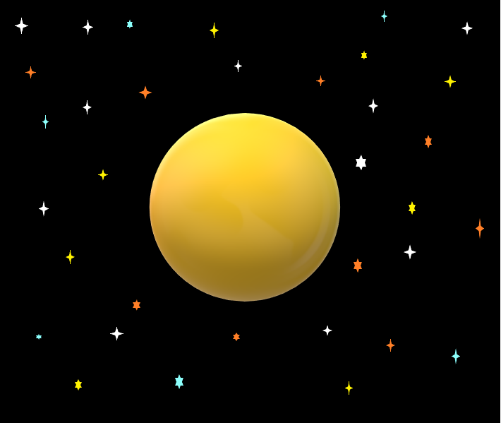

# Space Vision
> Our team consists of Matvey Lubaev, Rayyan Kahn, Tara Meazell, and Benito Juarez.

> We are creating a web-based application that can pull desired information from NASA’s API library and display it to users.

> We are creating the app for students who are trying to learn more about NASA’s research. Attempting to allow ease of access by providing an app that can pull info from keywords.

> We hope to allow easy access to desired data from NASA’s APIs. The program will have a hardcoded key to access the API so users will not have to create their own to pull information

## Table of Contents
* [General Info](#general-information)
* [Technologies Used](#technologies-used)
* [Features](#features)

## General Information

his

## Technologies Used
* [Html](https://html.com/)
* [CSS](https://developer.mozilla.org/en-US/docs/Web/CSS)
* [JavaScript](https://www.javascript.com/)
* [React.js](https://reactjs.org/)

## Features
- NAVBAR: Navigation bar (navigates different pages)
	- As a user, I would like a way to navigate to different pages on the site.
- SEARCH BAR: Search bar to search for information on the website(based on keywords)
	- As a student, I would like to be able to view data from nasa's open apis in an easy to digest format.
- HEADER: Website header to have site name and logo( every page will have the same header)
	- As a user, I would like the website to have a site wide header.
- APITEXTDISPLAY: Displaying text information ( will display the text info from different APIs to the user after a keyword search)
	- As a student, I would like a way to read the text data from NASA's APIs.
- APIPICDISPLAY: Display pictures from different APIs(will display the pictures from different APIs to the user on the website)
	- As a student, I would like a way to view the pictures from NASA's API's
- GRAPHGENERATOR: Display of data in the form of charts or graphs
	- As a student I would like to be able to view data from nasa's open apis in an easy to digest format.
- ABOUT: About page ( will explain to the user how the website can be navigated and why the website was created)
	- As a user, I would like an about page that explains what the website is about.