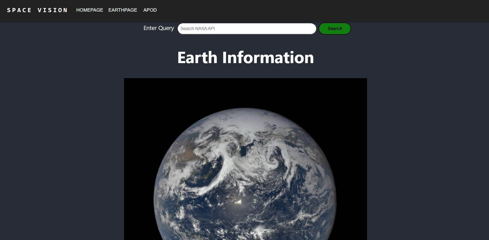

# Space Vision
> Our team consists of Matvey Lubaev, Rayyan Kahn, Tara Meazell, and Benito Juarez.

> We are creating a web-based application that can pull desired information from NASA’s API library and display it to users.

> We are creating the app for students who are trying to learn more about NASA’s research. Attempting to allow ease of access by providing an app that can pull info from keywords.

> We hope to allow easy access to desired data from NASA’s APIs. The program will have a hardcoded key to access the API so users will not have to create their own to pull information

## Table of Contents
* [General Info](#general-information)
* [Technologies Used](#technologies-used)
* [Features](#features)
* [Citations](#citations)

## General Information

## Technologies Used
* [Html](https://html.com/)
* [CSS](https://developer.mozilla.org/en-US/docs/Web/CSS)
* [JavaScript](https://www.javascript.com/)
* [React.js](https://reactjs.org/)

## Features
- NAVBAR: Navigation bar (navigates different pages)
	- As a user, I would like a way to navigate to different pages on the site.
- SEARCH BAR: Search bar to search for information on the website(based on keywords)
	- As a student, I would like to be able to view data from nasa's open apis in an easy to digest format.
- HEADER: Website header to have site name and logo( every page will have the same header)
	- As a user, I would like the website to have a site wide header.
- APITEXTDISPLAY: Displaying text information ( will display the text info from different APIs to the user after a keyword search)
	- As a student, I would like a way to read the text data from NASA's APIs.
- APIPICDISPLAY: Display pictures from different APIs(will display the pictures from different APIs to the user on the website)
	- As a student, I would like a way to view the pictures from NASA's API's
- GRAPHGENERATOR: Display of data in the form of charts or graphs
	- As a student I would like to be able to view data from nasa's open apis in an easy to digest format.
- ABOUT: About page ( will explain to the user how the website can be navigated and why the website was created)
	- As a user, I would like an about page that explains what the website is about.

## Citations
-'Natural Events' page images all from "https://www.clipartmax.com/", except for the following:
SevereStorms - "https://openclipart.org/"
WaterColor - "https://iconarchive.com/"
DustHaze - "https://www.citypng.com/"

-Mars weather embedded credit to "https://mars.nasa.gov/msl/weather/"

-Background images:
	Homepage background - "https://www.nasa.gov/feature/goddard/2017/nasa-s-webb-telescope-to-witness-galactic-infancy"
	Mars page background - "https://shab42.artstation.com/projects/6adXEW"
	All other pages background - "https://www.freepik.com/premium-photo/stars-dark-blue-sky-night_7224165.htm" (self-modified)

## Sprint 1

## Contributions
### Benito:
- [SV-7](https://cs3398f22romulans.atlassian.net/browse/SV-7?atlOrigin=eyJpIjoiZGIxOTU5MmJhZDFhNDExZGI3ZmMzMzlkOTJmMWI3N2UiLCJwIjoiaiJ9) Create app with npm
	- https://bitbucket.org/cs3398f22romulans/space-vision/commits/f2e5c205d836338e7a23997d232e6659fdd86d84
	
- [SV-9](https://cs3398f22romulans.atlassian.net/browse/SV-9?atlOrigin=eyJpIjoiZTUzMTA1MjBjNjA3NDgyZDhmMTM5YTE3ZThhMmFiMGMiLCJwIjoiaiJ9) Create the base app header component
	- https://bitbucket.org/cs3398f22romulans/space-vision/commits/e1cf7deb28101f4b6ff0fcb84e0d5b5850d905eb
	
- [SV-11](https://cs3398f22romulans.atlassian.net/browse/SV-11?atlOrigin=eyJpIjoiY2E0YWVkN2EwOTkxNGI2MjkyZmNlMTE3MWZkNTgxMmEiLCJwIjoiaiJ9) Create Navigation Bar
	- https://bitbucket.org/cs3398f22romulans/space-vision/commits/4cac0fff3f7596206515655b896074cf3fc32736
	
- [SV-19](https://cs3398f22romulans.atlassian.net/browse/SV-19?atlOrigin=eyJpIjoiNzNlMWQ5ZmM4NmNjNDJkMjhkMjQ2NzYxZmMxZjFkODYiLCJwIjoiaiJ9) Create a base API call template
	- https://bitbucket.org/cs3398f22romulans/space-vision/commits/36151de7725463e7a8dc8dd9bdfcc46d7bfc92a1
	
- [SV-20](https://cs3398f22romulans.atlassian.net/browse/SV-20?atlOrigin=eyJpIjoiOGE0YWE0YWUzY2NhNDk0ZWFhNjVlM2ZiZjRmMDU0YTEiLCJwIjoiaiJ9) Create the base homepage
	- https://bitbucket.org/cs3398f22romulans/space-vision/commits/ee07ada10c757a5a891977cf57139fe13094aa95

- [SV-21](https://cs3398f22romulans.atlassian.net/browse/SV-21?atlOrigin=eyJpIjoiZDJlZmQ3Zjc2ZDg2NGVmYTg5OGEzNjNlMmE2YjgyZjIiLCJwIjoiaiJ9) Create a page for the earth information
	- https://bitbucket.org/cs3398f22romulans/space-vision/commits/e070aadb0bcdd2f125039a01611cf52bb25c17ab
### Rayyan
- Homepage design
https://bitbucket.org/cs3398f22romulans/space-vision/commits/7c10228b113735127e6b39311e3a0af7b4214fad
- Search Bar added to webpages
https://bitbucket.org/cs3398f22romulans/space-vision/commits/934cbc90655a5e8ff027f671191d3fd7f3215c93
- Customized search bar UI 
https://bitbucket.org/cs3398f22romulans/space-vision/commits/7eed1eb8740a23099281b958c185006e128e8f61
-Ui design for info display 
https://bitbucket.org/cs3398f22romulans/space-vision/commits/b3c3b0dd8495e9f55644189cd07c119c44dddb96

### Matvey
(https://cs3398f22romulans.atlassian.net/browse/SV-33?atlOrigin=eyJpIjoiYmIxMjBiMjc2NTBjNDhmMWFiM2FlNjFhMDM2ZDYzY2EiLCJwIjoiaiJ9)
Research basic functionality of Javascript

-https://bitbucket.org/cs3398f22romulans/space-vision/commits/9c8eb4fab0ea289a8806709e0321fe0080870654
-https://bitbucket.org/cs3398f22romulans/space-vision/commits/5c81f3fb1597d888bab1c1b83b23c8aedfc6df75
-----------------------------------------------------------------------
(https://cs3398f22romulans.atlassian.net/browse/SV-32?atlOrigin=eyJpIjoiZjIxODRmNDgwOGI5NDRiMTk2Mjg4OTJiMjVlYzBiNGYiLCJwIjoiaiJ9)
Getter function to pull desired information from API

-https://bitbucket.org/cs3398f22romulans/space-vision/commits/b65c8f3339dcec4029de4b5a2b2fcaf3c3050a0e
-https://bitbucket.org/cs3398f22romulans/space-vision/commits/c0af36a66ba18e27636559f19b92871128dd1ccc
-----------------------------------------------------------------------
(https://cs3398f22romulans.atlassian.net/browse/SV-31?atlOrigin=eyJpIjoiMTlkNTY0YmY3YTBjNDM4Nzg0YWQwZTc5Y2M1Y2Y4YWQiLCJwIjoiaiJ9)
Create a function which can use the API key to access NASA API 

-https://bitbucket.org/cs3398f22romulans/space-vision/commits/bf24bea363b4604eab1280260dcc2ac1f96fbcda
-https://bitbucket.org/cs3398f22romulans/space-vision/commits/aac8a2eb361203040a4595cfdd665e1547dec21e

## Next Steps

### Benito
- Will make the earth page dynamic and display text information about the images that are being dynamically rendered.

- Create an about page that will hold information about our project.

- Will look into creating graphs from information provided by the DONKI API and other similar APIs

### Tara
- make improvements to the APOD page to make it more visually appealing / interesting

- Take on tasks as we continue to add more data from APIs

### Rayyan 
- Will create full functionality for the search bar

- Create a new page to display information from user search 

### Matvey
- Create a near earth objects page that displays asteroids that are closest to Earth, their size, name, if they're a threat.
- Create a Mars page that displays photos taken by Mars rovers.
- Filter the Mars photos by date, camera angle taken from, location, etc.

## Sprint 2

## Contributions
### Benito:
- [SV-56](https://cs3398f22romulans.atlassian.net/browse/SV-56?atlOrigin=eyJpIjoiNDVlMTNiNjkzMTI2NDU4MmI1ZDJlZmNjZWZkNTNmNTkiLCJwIjoiaiJ9) Make the Earth page dynamically display pictures
	- https://bitbucket.org/cs3398f22romulans/%7B6c784673-6e1a-4c5d-b3bc-b28fbb2c0bd9%7D/commits/19fc2bf74198bcd5719c5d2324a753c7313c3f22
- [SV-58](https://cs3398f22romulans.atlassian.net/browse/SV-58?atlOrigin=eyJpIjoiOTM5NDUwYTI2ZjA1NGFjMDliNmFmNWYzNWE4YmM1MjciLCJwIjoiaiJ9) Create a function to call the Fireball Data API
    - https://bitbucket.org/cs3398f22romulans/%7B6c784673-6e1a-4c5d-b3bc-b28fbb2c0bd9%7D/commits/f14e84f4edfb857a6b0eacabde6adfa24f6747b4
- [SV-59](https://cs3398f22romulans.atlassian.net/browse/SV-59?atlOrigin=eyJpIjoiZTM0Nzk0NjQ0ZTU4NGIxOGExNjVmMTBiZDU2NWVlOTYiLCJwIjoiaiJ9) Create a Page to display data from the Fireball API call function
	- https://bitbucket.org/cs3398f22romulans/%7B6c784673-6e1a-4c5d-b3bc-b28fbb2c0bd9%7D/commits/530984cfc65abcc2928b251a6c2b4cc97b586a1d
- [SV-60](https://cs3398f22romulans.atlassian.net/browse/SV-60?atlOrigin=eyJpIjoiNTc5ZmUzMmY5ODJlNGFlN2FjMGJjZmEyMDg2MDAzM2EiLCJwIjoiaiJ9) Create a graph from the Fireball API call function
	- https://bitbucket.org/cs3398f22romulans/%7B6c784673-6e1a-4c5d-b3bc-b28fbb2c0bd9%7D/commits/8c972c6b906aeb7cbfd403683e799fef840cfbc6
- [SV-50](https://cs3398f22romulans.atlassian.net/browse/SV-50?atlOrigin=eyJpIjoiNDE1Y2E4ZmNkOTE2NDQxYmE0Nzk4MmRiNmM3NDdiOWEiLCJwIjoiaiJ9) Add a user input section to allow the user to control the dates for the data
	- https://bitbucket.org/cs3398f22romulans/%7B6c784673-6e1a-4c5d-b3bc-b28fbb2c0bd9%7D/commits/881c1ea40579c0fd8a1bf87949edf590588f3d3f
- [SV-54](https://cs3398f22romulans.atlassian.net/browse/SV-54?atlOrigin=eyJpIjoiNjNmYTQyMjFjYWZhNDFjZmIyZWU1ZWVkNTkzYTI2YjQiLCJwIjoiaiJ9) Create a graph using the data from the CAD API call function
	- https://bitbucket.org/cs3398f22romulans/%7B6c784673-6e1a-4c5d-b3bc-b28fbb2c0bd9%7D/commits/a327ddc30ef554038927e9e35edd366230bdc09d
- [SV-62](https://cs3398f22romulans.atlassian.net/browse/SV-62?atlOrigin=eyJpIjoiODQyNTcxMDE3MjdhNDU1ODlmZDAxYTM2Nzg4NWRlN2UiLCJwIjoiaiJ9) Hotfix to fix TypeError: Cannot read properties of undefined (reading '0') error on refresh of the fireball page.
	- https://bitbucket.org/cs3398f22romulans/%7B6c784673-6e1a-4c5d-b3bc-b28fbb2c0bd9%7D/commits/d4616f0f24bdef18fe4b76f0953dd236eb46eb3a
- [SV-68](https://cs3398f22romulans.atlassian.net/browse/SV-68?atlOrigin=eyJpIjoiNDg3NDFmMTg3M2NlNGU0OTg0OTA1ODc1MTY5YmM5ZjUiLCJwIjoiaiJ9) Hotfix to map undefined on graph pages
	- https://bitbucket.org/cs3398f22romulans/%7B6c784673-6e1a-4c5d-b3bc-b28fbb2c0bd9%7D/commits/316701986d9a5e12007cbd370a07218e95d0b607
- [SV-69](https://cs3398f22romulans.atlassian.net/browse/SV-69?atlOrigin=eyJpIjoiN2FhZTRkOTkxNzM3NGI1MThjMTQzNjE0OGVkYzY4MmMiLCJwIjoiaiJ9) Reformat and condense the file structure
	- https://bitbucket.org/cs3398f22romulans/%7B6c784673-6e1a-4c5d-b3bc-b28fbb2c0bd9%7D/commits/b7d09f276fe84de78960a391a0cebb992b23aa0e
	
	
### Matvey:
[SV-48]Add a 'mars rover photos' page that will have pictures of mars taken by different rovers and cameras on different dates.
https://cs3398f22romulans.atlassian.net/browse/SV-48?atlOrigin=eyJpIjoiZmJhZDFiYTNhMWRhNGUzOGIyY2E3MzIzNTVlYTM4ZGEiLCJwIjoiaiJ9
https://bitbucket.org/cs3398f22romulans/space-vision/commits/ff0c9d50d7684f1f4b1cf12935e4f9536ec9e2c3

[SV-49]create a filter for the mars photos that filters out specific photos based on filter parameter such as date
https://cs3398f22romulans.atlassian.net/browse/SV-49?atlOrigin=eyJpIjoiMGFmODRmNWQ1NmY5NDM5Yjg0MGU4NmNlNTc1OTAwYmUiLCJwIjoiaiJ9
https://bitbucket.org/cs3398f22romulans/space-vision/commits/e8ea31856937c5bf23a595e964c708a0ce209cae

[SV-57]sort the photos based on which rover took them
https://cs3398f22romulans.atlassian.net/browse/SV-57?atlOrigin=eyJpIjoiMjRhZWI3ZTA1NmNkNDMyMGI3YWFiZDcyOGMwODkxNjUiLCJwIjoiaiJ9
https://bitbucket.org/cs3398f22romulans/space-vision/commits/d3eb531943f1fe32afe8c4bce62a0a36ff16acef

[SV-41]Sort and display search data by most recent
https://cs3398f22romulans.atlassian.net/browse/SV-41?atlOrigin=eyJpIjoiZmFlZjYyZjA1NDM3NDIyYTlkYTgwNGY1ZjJiZDEwYjMiLCJwIjoiaiJ9
https://bitbucket.org/cs3398f22romulans/space-vision/commits/9f661c61829d61bf2fab35833ff156eb1cde9295

[SV-34]Use figma to design/redesign UI into an improved version
https://cs3398f22romulans.atlassian.net/browse/SV-34?atlOrigin=eyJpIjoiNGQyYzZkMWJiNzFmNGU4MjgxYTQ1ZWJjMjE2ZDNlMWYiLCJwIjoiaiJ9
https://bitbucket.org/cs3398f22romulans/space-vision/commits/0b603d69bbc3e5731f1199593dccfaa12a801b05
### Rayyan:
[SV-65] (https://cs3398f22romulans.atlassian.net/browse/SV-65) Setting up api call to take user input from textbox and displaying desired results and also had to reformat how info was displayed on page
https://bitbucket.org/cs3398f22romulans/space-vision/commits/d05f6e640c3712e5ed92518bff05d02581bae56d
[SV-67] (https://cs3398f22romulans.atlassian.net/browse/SV-67).  Adding animation to text on display page
https://bitbucket.org/cs3398f22romulans/space-vision/commits/d6f67e2a7545c71838fcdfdb2571b536d316fa9e
[SV-63] (https://cs3398f22romulans.atlassian.net/browse/SV-63).  hotfix to Resolve merge conflict
https://bitbucket.org/cs3398f22romulans/space-vision/commits/62453c4ae805932077952523382c9267a6417960
[SV-38] (https://cs3398f22romulans.atlassian.net/browse/SV-38) Hitting search btn takes user to display search results page
https://bitbucket.org/cs3398f22romulans/space-vision/commits/e34b05d06db81de9a07c02c9d58acf0bce4770b7
### Tara:

[SV-39](https://cs3398f22romulans.atlassian.net/browse/SV-39) -Created the page and link in header for the graph page that will show Close Appraoch Data (CAD)

https://bitbucket.org/cs3398f22romulans/space-vision/commits/9dee8441d9d2ce13cb41015868463f2a87f49f92

[SV-43](https://cs3398f22romulans.atlassian.net/browse/SV-43)-Created the call to the Close Approach Data (CAD) API

https://bitbucket.org/cs3398f22romulans/space-vision/commits/0f04f264efcc78cbd2e3fd0353e751a2f1a18754

[SV-45](https://cs3398f22romulans.atlassian.net/browse/SV-45)-Improved the appearance of the graph on the graph page

https://bitbucket.org/cs3398f22romulans/space-vision/commits/06acc30cc9c9dd81573aa1ed67d0fef69fc3fd30

[SV-46](https://cs3398f22romulans.atlassian.net/browse/SV-46)-Added functionality to view different graphs for CAD about different planets

https://bitbucket.org/cs3398f22romulans/space-vision/commits/14a874761aa72a70b41c9c535a798d650e0f3e5b

## Next Steps

### Benito
- Add more explanatory information to the graph pages to give users a better understanding of the pages.

- Add more user control to the data being passed into the graphs as well as possibly choosing which graphs are displayed

- Adding a page displaying information from NASA's Exoplanet API
### Rayyan 
- Create a page that can save previous search results

- Redesign UI to be more userfriendly 

- Figure out how to put the search bar inside the header 

- Make use of another API from NASA API database on new page 

- create about page 

### Tara
- Fix aspect ratios with images appearing in search results

- add ability to see previous APODs on the APOD page

- add API call to NASA's Earth API and add more function to the Earth page

### Matvey
- Fix bug where some mars photos are too small

- Fix format of mars photo's information

- Utilize APIs to display data from another one of NASA's databases

## Sprint 2

## Contributions

### Tara:
[SV-86](https://cs3398f22romulans.atlassian.net/browse/SV-86) - Added ability to see previous dates on APOD Page rather than only showing today's image. It now takes a date parameter
https://bitbucket.org/cs3398f22romulans/space-vision/branch/feature/SV-86-add-ability-to-see-previous-dates-

[SV-82](https://cs3398f22romulans.atlassian.net/browse/SV-82) - Created a call to the EARTH API. The EARTH API will be used to display sattelite images later.
https://bitbucket.org/cs3398f22romulans/space-vision/branch/feature/SV-82-create-call-to-the-earth-api

[SV-83](https://cs3398f22romulans.atlassian.net/browse/SV-83) - Displayed a sattelite image on the page. Successfuly used the EARTH API to display one sattelite image of Houston, TX
https://bitbucket.org/cs3398f22romulans/space-vision/branch/feature/SV-83-display-a-satellite-image-on-the-p

## Next Steps (What could we work on)

### Tara:
- Could actually implement sattelite images to take longitude and lattitude parameters

- Could make presets for cities to view in sattelite images

- Could improve CSS styling on APOD page, graph page

